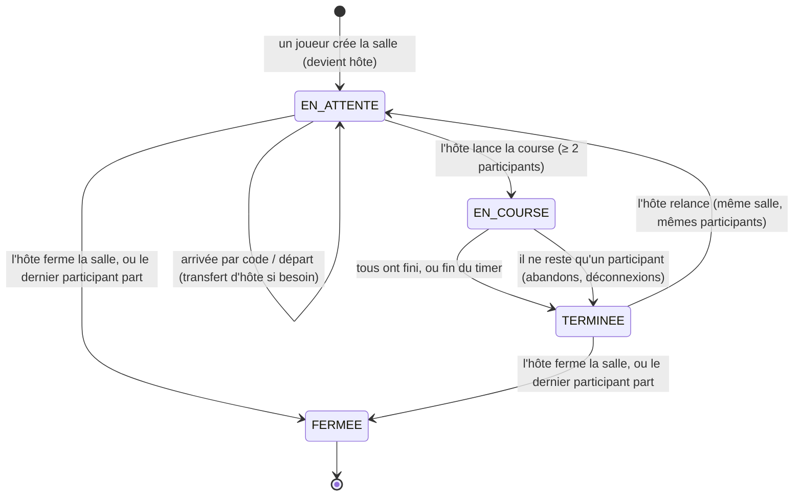

# Machine à états d'une salle

Champ `Room.status` ([modèle de données](modele-de-donnees.md)). L'énumération Prisma contient déjà
`EN_ATTENTE`, `EN_COURSE` et `TERMINEE` ; seul `EN_ATTENTE` est utilisé aujourd'hui.

## Déclencheurs

| Transition | Qui | Condition | Exigence | Statut |
|---|---|---|---|---|
| création → `EN_ATTENTE` | utilisateur ou invité | connecté ou invité | LOBBY-01 | **Implémenté** |
| arrivée dans `EN_ATTENTE` | utilisateur ou invité | code valide, salle en attente | LOBBY-02 | **Implémenté** (par code) ; salles publiques et liens privés prévus |
| départ dans `EN_ATTENTE` | participant (bouton) ou serveur (déconnexion > 30 s) | — | LOBBY-06 | **Implémenté**, avec transfert d'hôte au plus ancien |
| `EN_ATTENTE` → `EN_COURSE` | hôte | au moins 2 participants | RACE-01, LOBBY-04 | Prévu |
| `EN_COURSE` → `TERMINEE` | serveur | tous arrivés, fin du timer, ou un seul participant restant | RACE-03, RACE-06 | Prévu |
| `TERMINEE` → `EN_ATTENTE` | hôte | — | LOBBY-05 | Prévu |
| → `FERMEE` | hôte (bouton) | — | LOBBY-05 | Prévu |
| → `FERMEE` | serveur | dernier participant parti | LOBBY-06 | **Implémenté** sous forme de **suppression** de la salle |

## Notes

- **`FERMEE` n'existe pas encore** dans l'énumération : aujourd'hui une salle vide est supprimée
  ([ADR 0006](../adr/0006-salles-transfert-hote.md)). Garder un état `FERMEE` (pour l'historique,
  STAT-03) ou continuer à supprimer sera décidé dans un ADR au checkpoint LOBBY-05.
- On ne rejoint qu'une salle `EN_ATTENTE` : le service refuse déjà les autres états
  (`roomNotWaiting`, testé dans `src/lib/rooms/service.test.ts`).
- Toute transition passe par le serveur, sous verrou de la ligne `Room` (`SELECT … FOR UPDATE`).
  Les clients n'envoient que des intentions ; leur identité vient de la session ([ADR 0007](../adr/0007-identite-socketio-session-authjs.md)).
- Pendant `EN_COURSE`, un participant déconnecté garde sa place pendant le délai de grâce
  (reconnexion automatique, RACE-05) ; au-delà, il est compté comme ayant abandonné (RACE-06).
