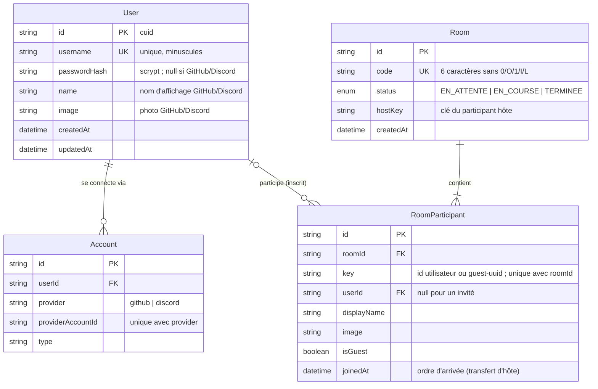
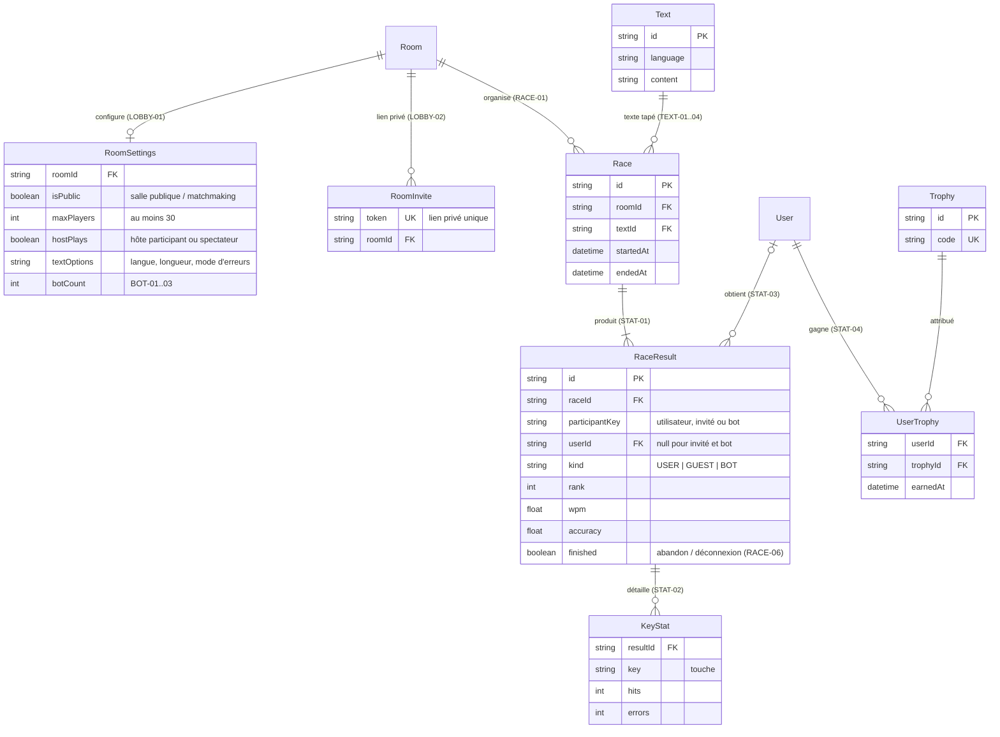

# Modèle de données

Source de vérité : [`prisma/schema.prisma`](../../prisma/schema.prisma). Base PostgreSQL, accès via
Prisma 7 ([ADR 0003](../adr/0003-prisma-postgresql.md)).

## Tables actuelles

| Table | Rôle |
|---|---|
| `User` | Utilisateur inscrit, par GitHub/Discord ou par nom d'utilisateur + mot de passe ; aucun courriel stocké ([ADR 0004](../adr/0004-authentification-authjs.md)). |
| `Account` | Lien entre un utilisateur et son compte GitHub ou Discord (format de l'adaptateur Prisma d'Auth.js) ; aucun jeton d'accès conservé. |
| `Room` | Salle rejointe par code, avec son état et son hôte ; supprimée quand le dernier participant part ([ADR 0006](../adr/0006-salles-transfert-hote.md)). |
| `RoomParticipant` | Présence d'un utilisateur ou d'un invité dans une salle ; `joinedAt` décide du prochain hôte. |

Remarques :

- Les **invités** n'ont pas de ligne `User` : ils n'existent que dans leur jeton de session et,
  le temps de leur présence, dans `RoomParticipant` (`isGuest = true`, `userId = null`).
- `Room.hostKey` désigne la `key` d'un participant de la salle (lien logique, pas de clé étrangère,
  car l'hôte peut être un invité).
- Pas de table `Session` : sessions JWT dans un cookie chiffré ([ADR 0004](../adr/0004-authentification-authjs.md)).
- `_prisma_migrations` (technique) suit les migrations appliquées ; visible via `/api/health`.

## Prévu (non créé en base)

Tables envisagées pour les exigences restantes ([matrice](../matrice-des-exigences.md)).
Les noms et champs sont indicatifs : chacune sera conçue, migrée et documentée au checkpoint qui la demande.

- **Statistiques d'invité** (AUTH-03, AUTH-04) : les résultats d'un invité seraient liés à sa
  `participantKey` (sans `userId`), pour les afficher en fin de course et pendant sa séance.
- **Bots** (BOT-01..03) : participants de course de type `BOT`, sans compte.
- **Bonus** (BONUS-01..03) : modèle à définir avec le cahier des charges détaillé.
